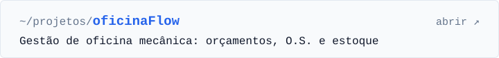
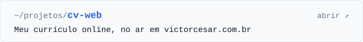
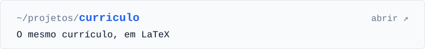
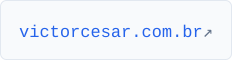

<picture>
  <source media="(prefers-color-scheme: dark)" srcset="assets/header-dark.svg">
  
</picture>

<picture>
  <source media="(prefers-color-scheme: dark)" srcset="assets/docker-ps-dark.svg">
  
</picture>

<picture>
  <source media="(prefers-color-scheme: dark)" srcset="assets/stack-dark.svg">
  
</picture>

<picture>
  <source media="(prefers-color-scheme: dark)" srcset="assets/formacao-dark.svg">
  
</picture>

<!-- Imagem com link: o <a> precisa ficar dentro de um 
. Solto no Markdown, o GitHub desmonta o <picture> e troca o link. -->

<a href="https://github.com/victorcsar/oficinaFlow"><picture>
  <source media="(prefers-color-scheme: dark)" srcset="assets/projeto-oficinaFlow-dark.svg">
  
</picture></a>

<a href="https://github.com/victorcsar/cv-web"><picture>
  <source media="(prefers-color-scheme: dark)" srcset="assets/projeto-cv-web-dark.svg">
  
</picture></a>

<a href="https://github.com/victorcsar/curriculo"><picture>
  <source media="(prefers-color-scheme: dark)" srcset="assets/projeto-curriculo-dark.svg">
  
</picture></a>

<a href="https://www.victorcesar.com.br"><picture>
  <source media="(prefers-color-scheme: dark)" srcset="assets/contato-site-dark.svg">
  
</picture></a>
<a href="https://br.linkedin.com/in/victorcesarbastos"><picture>
  <source media="(prefers-color-scheme: dark)" srcset="assets/contato-linkedin-dark.svg">
  
</picture></a>
<a href="mailto:victorcesagx@gmail.com"><picture>
  <source media="(prefers-color-scheme: dark)" srcset="assets/contato-email-dark.svg">
  
</picture></a>

